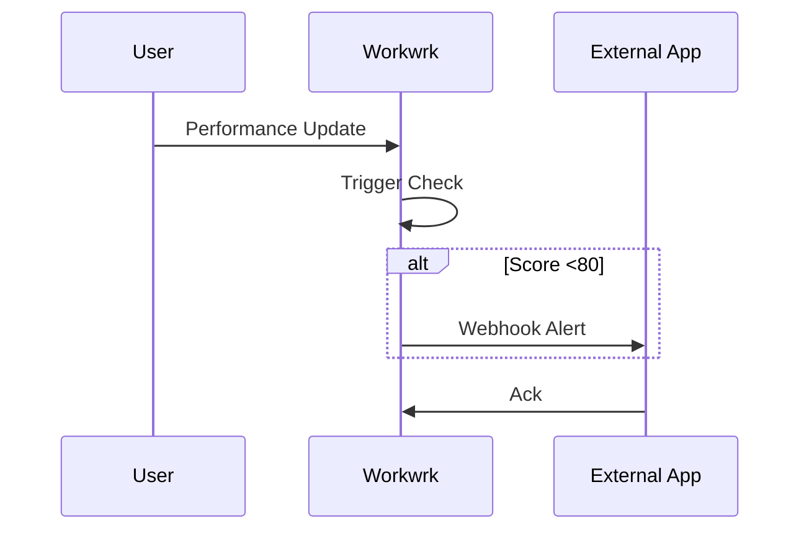

## Overview

Workwrk integrates with your existing tools to unify people, processes, and performance data. Connect third-party apps, set up webhooks for real-time updates, import/export data, and configure automation triggers. This guide covers all options to build seamless workflows.

<Callout kind="info">
  Access integrations from your Workwrk dashboard at `https://app.workwrk.com/settings/integrations`.
</Callout>

## Third-Party Connections

Workwrk supports native integrations with popular tools for HR, finance, and productivity. Use the dashboard to connect accounts securely via OAuth.

<Columns cols={3}>
  <Card title="Slack" icon="message-circle" href="https://app.workwrk.com/integrations/slack">
    Send kudos, alerts, and performance updates to Slack channels.
  </Card>
  <Card title="Google Workspace" icon="chrome" href="https://app.workwrk.com/integrations/google">
    Sync user data, calendars, and docs for onboarding workflows.
  </Card>
  <Card title="QuickBooks" icon="dollar-sign" href="https://app.workwrk.com/integrations/quickbooks">
    Track spend, vendors, and financial KPIs automatically.
  </Card>
  <Card title="Jira" icon="git-branch" href="https://app.workwrk.com/integrations/jira">
    Link tasks, OKRs, and SOPs to development workflows.
  </Card>
  <Card title="Zendesk" icon="help-circle" href="https://app.workwrk.com/integrations/zendesk">
    Connect customer feedback to performance reviews.
  </Card>
  <Card title="More..." icon="plus" href="https://app.workwrk.com/settings/integrations">
    Explore 50+ apps in the integrations marketplace.
  </Card>
</Columns>

## Webhook Setup

Webhooks enable real-time data flow from Workwrk events like performance updates or kudos. Receive payloads at your endpoint.

<Steps>
  <Step title="Create Webhook" icon="plus">
    Navigate to `Settings > Integrations > Webhooks > New Webhook`.
    
    Enter your endpoint URL, e.g., `https://your-webhook-url.com/workwrk`.
  </Step>
  <Step title="Select Events" icon="zap">
    Choose events: `performance.updated`, `kudos.sent`, `task.completed`.
  </Step>
  <Step title="Verify & Test" icon="check-circle">
    Click "Test" to send a sample payload. Verify receipt on your server.
  </Step>
</Steps>

Example incoming webhook payload:

<CodeGroup tabs="JSON">
  ```json
  {
    "event": "performance.updated",
    "user_id": "usr_123abc",
    "score": 92,
    "timestamp": "2024-10-15T10:30:00Z",
    "data": {
      "name": "Maya Chen",
      "role": "Head of Engineering"
    }
  }
  ```
</CodeGroup>

## Data Import and Export

Import historical data or export reports for analysis.

<Tabs>
  <Tab title="CSV Import" icon="upload">
    Download templates from `Settings > Data > Import`.
    
    ```csv
    name,email,role,score
    Maya Chen,maya@workwrk.com,Engineering,92
    Karim Patel,karim@workwrk.com,Operations,87
    ```
    
    Upload via dashboard. Supports up to `10,000` rows.
  </Tab>
  <Tab title="API Export" icon="code">
    Use the API to fetch data programmatically.
    
    ```bash
    curl -H "Authorization: Bearer YOUR_API_KEY" \
         "https://api.workwrk.com/v1/performance?limit=100"
    ```
  </Tab>
</Tabs>

## Automation Triggers

Set up triggers to automate actions across integrations.

<Expandable title="Common Triggers" default-open="true">
  - Performance score `<80`: Notify manager via Slack.
  - New kudos: Update composite score and email recipient.
  - Task overdue: Assign AI-suggested owner.
</Expandable>



<Callout kind="tip">
  Test automations in sandbox mode before production. Monitor logs at `https://app.workwrk.com/automations/logs`.
</Callout>

<Columns cols={2}>
  <Card title="Next: API Reference" icon="code" href="/api-reference">
    Dive into full REST API for custom integrations.
  </Card>
  <Card title="Troubleshooting" icon="alert-triangle" href="/troubleshooting">
    Common issues and solutions.
  </Card>
</Columns>