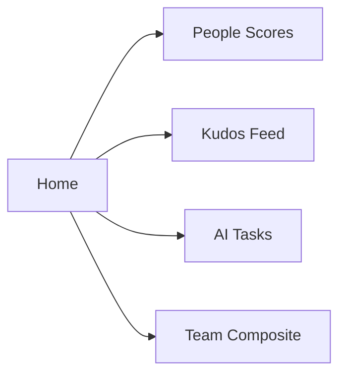

## Prerequisites

<Callout kind="info">

Before starting, ensure you have:

- A modern web browser (Chrome, Firefox, Safari, or Edge)
- An email address for account creation
- Permissions to invite team members (admin access)

Free forever for up to 5 people. No credit card required.

</Callout>

## Create a free account

Follow these steps to sign up and get started immediately.

<Steps>
  <Step title="Visit the signup page" icon="external-link">
    Navigate to [https://www.workwrk.com/signup](https://www.workwrk.com/signup).
  </Step>
  <Step title="Enter your details" icon="user">
    Provide your email, name, and company name. Click `Sign up`.
  </Step>
  <Step title="Verify your email" icon="mail">
    Check your inbox for a verification email from Workwrk and click the link.
  </Step>
  <Step title="Complete onboarding" icon="check-circle">
    Answer a few quick questions about your team size and goals to personalize your dashboard.
  </Step>
</Steps>

## Log in and dashboard tour

Once signed up, access your Workwrk dashboard.

<Steps>
  <Step title="Log in" icon="log-in">
    Go to [https://app.workwrk.com/login](https://app.workwrk.com/login) and enter your credentials.
  </Step>
  <Step title="Tour the home surface" icon="home">
    You'll land on the Home surface — your morning command center. Review key metrics like team composite scores and recent kudos.
  </Step>
  <Step title="Navigate surfaces" icon="layout">
    Use the left sidebar to switch between People, Work, Money, Talent, Culture, and Growth hubs.
  </Step>
</Steps>

## Set up your team

Add your team members to start tracking people and performance.

<Tabs>
  <Tab title="Manual Invite" icon="mail">
    <Steps>
      <Step title="Go to People" icon="users">
        Click the `People` surface.
      </Step>
      <Step title="Invite members" icon="plus">
        Click `Invite team member`, enter emails, and assign roles (e.g., Head of Engineering).
      </Step>
    </Steps>
  </Tab>
  <Tab title="Bulk Import" icon="upload">
    <Expandable title="Advanced: CSV Upload" default-open="false">
      Download the sample CSV template, populate with names, emails, and roles, then upload via the `Bulk import` button.
    </Expandable>
  </Tab>
</Tabs>

<Callout kind="tip">
  Team members receive an invite email. They can join in under 2 minutes.
</Callout>

## Explore the home surface

The Home surface connects all your data into one view.

Key elements:

- **Composite scores**: Track overall team performance (e.g., 87/100).
- **Kudos**: Give and receive recognition.
- **AI insights**: Auto-assigned tasks and focus areas.

<Board title="Sample Team Status">
  <BoardColumn title="On Track" color="2" icon="check-circle">
    <BoardCard title="Maya Chen" description="Head of Engineering - 92" icon="zap" />
    <BoardCard title="Priya Iyer" description="COO - 95" icon="shield" />
  </BoardColumn>
  <BoardColumn title="In Review" color="1" icon="loader">
    <BoardCard title="Karim Patel" description="VP Operations - 87" dueDate="2024-12-15" />
  </BoardColumn>
  <BoardColumn title="At Risk" color="8" icon="alert-triangle">
    <BoardCard title="Dani Park" description="Sales Lead - 73" author="Maya" />
  </BoardColumn>
</Board>

## Next steps

Dive deeper into Workwrk's surfaces.

<Columns cols={2}>
  <Card title="People & Performance" icon="users" href="/people">
    Manage org charts, reviews, and KPIs.
  </Card>
  <Card title="Work & SOPs" icon="clipboard-list" href="/work">
    Track tasks, OKRs, and standard operating procedures.
  </Card>
  <Card title="Money & Spend" icon="dollar-sign" href="/money" horizontal>
    Control vendors, budgets, and financials.
  </Card>
  <Card title="Culture & Kudos" icon="heart" href="/culture" horizontal>
    Boost engagement with surveys and recognition.
  </Card>
</Columns>

<Callout kind="success">
  Ready for more? [Book a demo](https://www.workwrk.com/demo) or explore [pricing](https://www.workwrk.com/pricing).
</Callout>