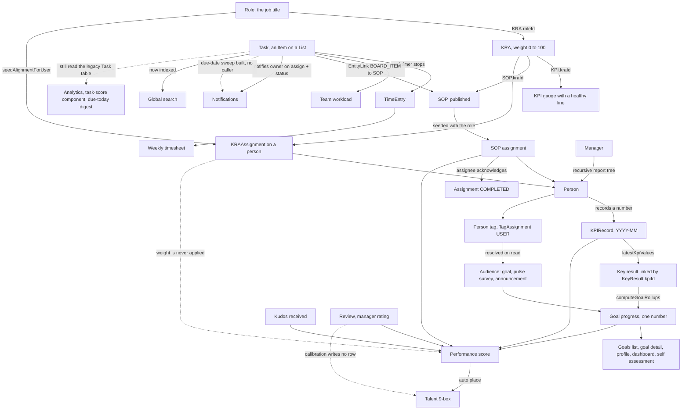

WorkwrK is two halves joined by a small number of real wires.

The **work chassis** is Spaces, Folders, Lists (boards) and Tasks (Items). The **alignment chain** is Role, KRA, KPI, and the person who holds them, with Goals sitting on top.

This page traces only the wires that actually exist in the code today. Where a connection looks obvious but is not built, it is listed at the bottom under "Links that are not wired". Read that section before you assume something rolls up.

## The map

Solid arrows are wires that exist. Dotted arrows are the connections people assume exist and that are not built.

## KPI reading to the one goal number

This is the spine of the product, and it is fully built.

1. A person opens their own profile from the Home sidebar's **Me** link, or **Teams → My Profile** (both go to `/people/me`, which redirects to `/people/<their id>`), and opens the KPI recorder. That posts to `/api/kpi-records/self-report`, or to `/api/kpi-records/batch` when a manager records on someone's behalf.
2. The record is scored on write by one shared function, `scoreKpiRecord` in `src/lib/kpi-record.ts`. Direction matters: HIGHER scores actual over target, LOWER scores target over actual, MAINTAIN subtracts the deviation from the line. A quantitative KPI with no `targetValue` produces a null score, and no baseline is ever invented. Qualitative KPIs are the exception: `resolveKpiLine` substitutes the rubric ceiling (the KPI's own target rating, or 5) so a 1 to 5 anchor rating always scores as rating over ceiling.
3. `latestKpiValues` in `src/lib/alignment.ts` picks the latest usable reading per gauge. Three rules are worth knowing: records with status REJECTED are ignored, records with no `actualValue` are ignored, and only canonical `YYYY-MM` period keys count. Older `2026-W33` and `2026-Q3` rows still exist in the database but no longer drive anything.
4. A key result linked to that KPI (`KeyResult.kpiId`) reports the gauge's reading instead of its own typed number. The typed number is not overwritten. It is returned as `enteredValue` so nothing you typed is lost.
5. `computeGoalRollups` derives every goal's effective progress in one pass: a leaf is the mean of its key results' live progress, a parent is the mean of its own key results plus each **measured** child. Unmeasured children contribute nothing, so three empty sub-goals cannot drag a measured sibling from 60% down to 15%.

A key result's own progress runs from its `startValue` toward its `targetValue`, and the direction is inferred from those two numbers rather than stored as a flag, so a "reduce it" target rises as the number falls.

Because every read path calls the same rollup, the same goal shows the same number everywhere: the goals list (`/api/okrs`), the goal detail page (`/api/okrs/[id]`), My Goals (`/api/okrs/my-okrs`), the home dashboard (`/api/dashboard/my-dashboard`), a person's profile (`src/lib/person-alignment.ts`), and the review self-assessment (`/api/reviews/[id]/self-assessment`).

When a goal has nothing to derive from, the API says so honestly. `progressSource` comes back as `MANUAL` when someone hand set a number and `NONE` when there is nothing at all, so the interface can show a dash instead of a 0% that reads as "behind".

## Role to KRA to person

KRAs hang off a job title, not off a person. `KRA.roleId` is the link.

When someone is hired into a role or moved to one, `seedAlignmentForUser` in `src/lib/alignment-assign.ts` copies that role's KRAs onto them as `KRAAssignment` rows, each inheriting the KRA's role level weight, and assigns every PUBLISHED SOP sitting under those KRAs.

The mirror also runs: when you add a KRA to a job title later, `seedKraToRoleHolders` pushes it to everyone who already holds that title. Both are idempotent, so re-running changes nothing.

Weights are validated on write, but only per weight. `/api/kra-assignments` (both the POST and the `[id]` PUT) rejects an individual weight of 0 or under or over 100. A total that would push a person above 100 is no longer rejected: the write goes through and the response carries a soft `weightWarning` plus the running `weightTotal`, so someone already over budget can still save the edit that rebalances them. Nothing requires the total to reach 100 either, so a person can legitimately sit at 60% assigned.

## SOP to KRA to person, and back again

The SOP arm of the same chain is now closed at both ends.

**Attaching.** An SOP carries a `kraId`, set from the **Linked KRA** picker on the SOP detail rail. That is the only thing that makes a procedure flow: a published SOP under a KRA is assigned automatically to everyone seeded into a role that owns that KRA.

**Completing.** The assignee closes their own loop. `POST /api/me/sops/<assignmentId>/ack`, reached from **Mark as read** in the SOP header or **Acknowledge** at `/sops/my-sops`, flips the `SOPAssignment` to COMPLETED, stamps `completedAt`, sets `stepsCompleted` to the step total and merges an attestation note into the assignment's progress JSON. It checks only that the assignment belongs to the caller, so it works for someone with no SOP permissions at all.

That completion is what the SOP read rate on **Teams → Alignment** and the SOP compliance component of the performance score both read.

**Back the other way.** A board task can link an SOP, which writes an `EntityLink` with `sourceType` BOARD_ITEM and `targetType` SOP. `/api/backlinks` reads every link pointing at a given SOP and buckets the sources by type, which is what fills the **Used by tasks** card on the SOP detail. The card is hidden when that bucket is empty rather than rendering an empty box.

Written SOPs feed the same graph from their body: on every save, `syncLinksFromBlocks` extracts the `@`-mentions out of the block content, so mentioning a task, a note or another SOP inside a written SOP becomes a real edge. This runs only for block-format content, so a step-by-step, checklist or click-capture SOP contributes no mention edges.

## Person tags to audiences

A person-tag is a `TagAssignment` row with `entityType="USER"` and `entityId` set to the user id, drawn from the org-wide `Tag` list. `src/lib/user-tags.ts` holds the three read helpers: tags per user for a page of people, the tag ids one user carries, and the users carrying any of a set of tags.

Three audiences consume it, and all three resolve on read rather than storing a member list:

| Surface | How a tag is stored | Where it resolves |
| --- | --- | --- |
| Goal contributors | `OKRAssignee.tagId` | `src/lib/goal-audience.ts` adds each tag's holders to the single active-user query, so a tag contributor renders as real people and only active, non-deleted ones |
| Pulse surveys | `audienceType: "TAGS"` plus `tagIds` | `/api/pulse-surveys` resolves holders for the audience count, and checks the viewer's own tag ids for membership |
| Announcements | `targetAudience: { type: "TAGS", ids }` | `src/lib/announcement-audience.ts` resolves holders for the notification fan-out, and checks the viewer's tag ids for the feed |

Two consequences worth stating plainly. Tagging someone tomorrow puts them inside every goal, survey and announcement already aimed at that tag, with nothing to re-save. And an archived tag resolves to nobody, everywhere, because every one of those queries filters on `tag: { archived: false }`.

The Directory reads the same rows for its per-person tag chips and its tag filter, and `/api/users?tagIds=` applies the filter server side inside your existing scope.

## The KPI approval loop

`KPIRecord.status` moves PENDING to SUBMITTED to APPROVED or REJECTED.

- The person submits from their profile.
- Their manager sees the queue at **Teams → KPI reviews** (`/team/kpi-reviews`), backed by `listKpiReviewsForManager`, which reads the manager's effective report tree and excludes their own records.
- Approving or rejecting writes a `Notification` row that deep links back to the person's profile, where a rejected record re-surfaces so they can resubmit.

A REJECTED record stops driving key results immediately, because `latestKpiValues` filters it out.

## What a manager's tree is

Two helpers exist and they are not identical. Know which one a surface uses.

- `getTeamUserIds` (`src/lib/team.ts`) is a recursive CTE over `User.managerId`. Solid line only, self included, unbounded depth. This is what the alignment scope, the goals list, the people directory and the KRA list use.
- `getEffectiveReportTree` (`src/lib/reporting-line.ts`) walks solid **and** dotted lines (`UserDottedLine`), capped at depth 6. This is what the timesheet team scope, the KPI review queue and the team alignment board use.

The practical difference: a dotted line report shows up in your KPI review queue and your team alignment board, but not in your goals list scope.

## Tasks, time and timesheets

There is exactly one automatic bridge from work to hours, and it is narrow.

When a card timer stops (`/api/timers/stop`), and only when the timer's `entityType` is `BOARD_ITEM`, `logTimerToTimesheet` in `src/lib/timesheet.ts` appends a `TimeEntry` to that person's open DRAFT weekly timesheet, linked back to the card. If the week is already submitted or approved, nothing is written. A locked sheet is never mutated.

`/timesheets` then sums entry hours per sheet. Managers read team sheets with `scope=team`, which uses the effective report tree, or `scope=approve` for SUBMITTED sheets awaiting them.

**Teams → Workload** (`/team/workload`) is separate from timesheets. It queries `Item` directly for open work owned by anyone in the manager's report tree, plus unassigned open work on boards that team actually touches. Done rows are excluded server side using each board's own status set, not a hardcoded status list.

## The performance score

`src/services/performanceScoreService.ts` computes one composite score per person per month and upserts it into `PerformanceScore`.

Components, each skipped when there is no data:

| Component | Source | Weight |
| --- | --- | --- |
| KPI | mean score of KPI records in the last 90 days, normalised against the 120 score cap | 40, configurable |
| Manager | latest COMPLETED review's calibrated score, or its manager rating | 25, configurable |
| Peer | last 20 SUBMITTED peer feedback ratings | 10, configurable |
| Self | self assessment KRA ratings, scaled from a 5 point scale | 5, configurable |
| SOP compliance | SOP assignment scores, or steps completed over steps total | 20, configurable |
| Goals | mean of owned goals' live rollup progress | 10, hardcoded |
| Tasks | legacy tasks completed over total in the last 30 days | 5, hardcoded |

Kudos received in the last 30 days add a flat bonus of up to 5 points. The weights are read from `settings.scoreWeights` on the organization, edited at **Settings → Scoring and reviews** (`/settings/scoring`). See the caveat below: the editor and the engine do not use the same key set.

Recalculation is triggered from: `/api/kpi-records` and `/api/kpi-records/batch`, `/api/kudos`, `/api/okrs/[id]/check-in`, `/api/sop-assignments/[id]/progress`, `/api/integrations/ingest`, and the `/api/v1` endpoints.

The score feeds three places: the person detail API, the home dashboard's top performers, and the **Talent** 9-box auto-place, which maps a score of 80 or above to High performance, 50 to 79 to Medium, below 50 to Low, and defaults potential to Medium for a human to adjust.

## Links that are not wired

These are the gaps that matter most, because each one looks like it should exist.

**KRA weight does not weight anything.** `KRAAssignment.weightage` is stored, validated, shown on your profile and on **Teams → Alignment**, and passed into AI prompts. No scoring math multiplies by it. The performance score's KPI component is a flat mean of every KPI record in 90 days. The KPI compliance percentage on the team board is a flat count of submitted-or-approved records over total. A 5% KRA and a 50% KRA currently count the same.

**The scoring weight editor and the scoring engine use different keys.** `/settings/scoring` edits four metrics: KPI attainment, SOP compliance, Behavioral rating and Peer, validated to sum to 100. The engine in `performanceScoreService.ts` reads five: `kpi`, `manager`, `peer`, `self`, `sopCompliance`. So `behavioral` is saved and then ignored, and `manager` (25) and `self` (5) always fall back to their defaults because the editor never writes them. Changing the sliders does change the KPI, SOP and peer weights. It does not do what the page implies.

**Review auto-populate ignores the cycle window.** `/api/reviews/[id]/self-assessment` pulls the person's most recent 20 KPI records regardless of the cycle's start and end dates, and averages their scores unweighted. Goal progress in the same response *is* derived correctly from the shared rollup.

**Calibration does not feed the 9-box.** `/api/reviews/[id]/calibration` writes `Review.calibratedScore` and moves the cycle to IN_CALIBRATION. It never writes a `TalentAssessment` row. The 9-box at `/talent` is populated either by hand or by auto-placing from performance scores. The two are not connected.

**Review cycles cannot be aimed at an audience.** Goals, pulse surveys and announcements all resolve an audience of people, departments, offices, roles or tags. A review cycle launch does not: it creates a Review row for every Active employee in the org, with no scoping or exclusion.

**A key result cannot be linked to a KPI from any screen.** The wire exists and is enforced correctly on both ends, but `KeyResult.kpiId` is only settable through the API. There is no picker.

**No SOP status change notifies anyone.** The Draft to In review to Approved to Published flow is real and gated, but nothing writes a `Notification` row on any transition. Assignment does notify; the review flow does not.

**Board tasks emit notifications, with one gap.** `src/lib/notify-item.ts` is the single door between the Item pipeline and the `Notification` table. Assigning or reassigning an Item notifies the new owner (`/api/boards/[id]/items` on create, `/api/items/[id]` on an owner change); changing its status notifies the owner plus everyone who has commented on the task; comment mentions notify the person mentioned. Every emission passes the recipient's `/settings/notifications` prefs and excludes the actor. The remaining gap is due dates: `notifyItemsDueToday` is written and idempotent, but nothing calls it at all, scheduled or otherwise. The scheduled job that does run walks the legacy `Task` table, so due-today and overdue notifications never fire for board work. The top right carries two bells: a **notifications** bell with an unread badge, and, beside it, the **reminders** bell.

**Four surfaces still read the legacy `Task` table, not `Item`.** Tasks you create on a List are `Item` rows. These do not see them:

- `/analytics` reads `/api/tasks`.
- The performance score's task component counts legacy Task rows.
- `/api/tasks/workload` reads legacy Task. The `/team/workload` page does not use it, it queries `Item` directly.
- The scheduled `tasks-due-today` job on `/api/email/send-reminders` queries `prisma.task`.

Global search used to be a fifth reader of the legacy table. It no longer is. `/api/search` was rewritten over the real work graph and now indexes Items, Boards, Spaces, Folders, Docs (notes), Whiteboards and people, plus the alignment and org surfaces that still have live routes (SOP, OKR, Meeting, Department, Idea, Policy, Announcement), with Space and Board visibility enforced. It deliberately skips the legacy `Task` table, and the removed finance result types (Vendor, PurchaseOrder, GlAccount, BudgetPlan) are gone with their 404 links.

**Automation declares more triggers than the product emits.** The registry lists 16 trigger types. Only five event names are ever dispatched, and most only from the API and integration paths rather than from in-app actions:

| Event | Emitted from |
| --- | --- |
| `task.status_changed` | `/api/items/[id]` PATCH (in-app) |
| `task.assignee_changed` | `/api/items/[id]` PATCH (in-app) |
| `task.created` | `/api/v1/tasks` and `/api/integrations/ingest` only |
| `kpi.recorded` | `/api/v1/kpi-records` and `/api/integrations/ingest` only |
| `kudos.created` | `/api/v1/kudos` and `/api/integrations/ingest` only |

So a rule on "task created" will not fire when you create a task in the app, and a rule on "KPI recorded" will not fire when someone records a number on their profile. The `review.completed`, `sop.published`, lead, quote, pickup and payment triggers have no producer at all.

**Goal progress and person profiles are correct by construction, but the stored column can lag.** `OKR.progress` is only written back by `persistGoalRollupChain` after a check-in, a key result change or a re-parent, and only when the source is a real rollup. If you query the database directly you may see a stale number. Always read through the API.

## What runs on a clock

Several of the wires above only move because a scheduled job pushes them. On the production server those jobs are crontab rows, listed in `scripts/CRON-SETUP.md`. The ones that change product behaviour:

| Job | Runs | Moves |
| --- | --- | --- |
| `/api/cron/reminders` | every 5 minutes | fires due reminders for people with the app closed; claims each row atomically against the in-app ticker so nothing double-fires |
| `/api/cron/okr-reminders` | 09:00 on weekdays | the stale-check-in nudge and email to a goal's owner, skipping goals whose cadence is None |
| `/api/cron/recurring-tasks` | hourly | clones an "on schedule" repeating task and advances its anchor |
| `/api/cron/review-cycles` | 08:00 daily | creates the Draft cycle for an auto-open cadence; it never launches one |
| `/api/cron/announcements-publish` | every 5 minutes | fires the notification and email fan-out for a scheduled announcement once it crosses `publishedAt`, then stamps `notificationsSentAt` so it never resends |

Anywhere other than that server, none of these run unless you register them.
